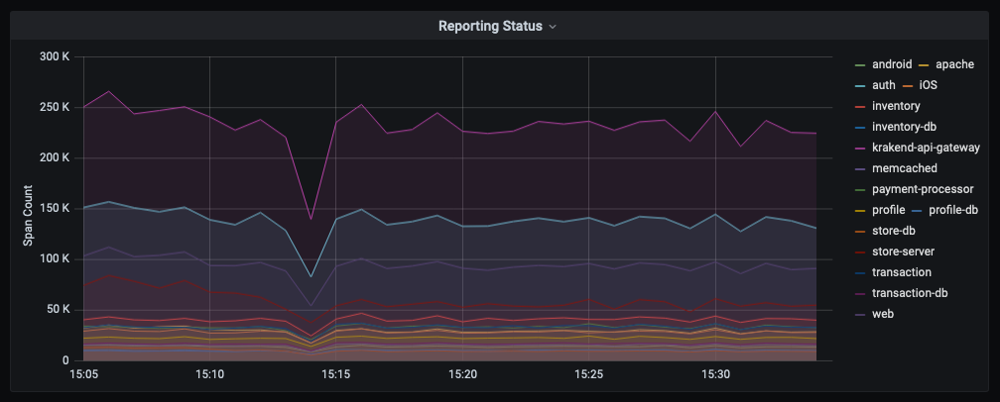

# Lightstep API Cookbook

This is a collection of various examples of using the Lightstep API and integrating Lightstep Data within your workflows. Note: This collection will expand over time.

### Reporting Status Timeseries

Take the Reporting Status page of Lightstep and convert it into a Timeseries to have granular visibility into spans sent, dropped spans, etc. per service.

[Example with Node-RED (or NodeJS), InfluxDB, and Grafana](./reporting-status-timeseries)

### Trace Differ

Take recurring snapshots for a query, and caluclate differences for a set of group-by keys.

[Example with MEVN stack](./trace-differ)

### Node.js Command Line Interface (CLI)

Some of the API functionality (taking snapshots, listing projects and services) is available using a convenience CLI provided by the [`lightstep-js-sdk`](https://github.com/lightstep/lightstep-api-js) project. See the project README for examples.
