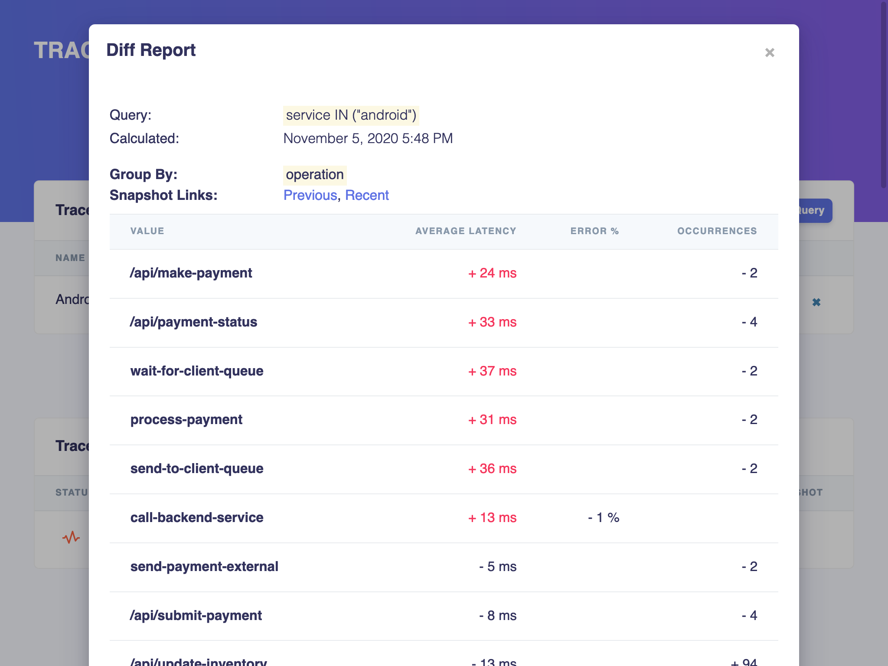

# Lightstep API Cookbook

This is a collection of various examples of using the Lightstep API and integrating Lightstep Data within your workflows. Note: This collection will expand over time.

### Reporting Status Timeseries


Take the Reporting Status page of Lightstep and convert it into a Timeseries to have granular visibility into spans sent, dropped spans, etc. per service.

[Example with Node-RED (or NodeJS), InfluxDB, and Grafana](./reporting-status-timeseries)

### Trace Differ



Take recurring snapshots for a query, and caluclate differences for a set of group-by keys.

[Example with MEVN stack](./trace-differ)


### Node.js Command Line Interface (CLI)

Some of the API functionality is available using a CLI provided by the [`lightstep-js-sdk`](https://github.com/lightstep/lightstep-api-js) project.

This SDK is used for both of [Lightstep's GitHub Actions](https://github.com/lightstep/lightstep-action-snapshot).

First, install the CLI using npm. You'll need to tell npm to use Lightstep's GitHub-based npm repository:

```sh
  $ npm_config_registry=https://npm.pkg.github.com/lightstep npm install -g @lightstep/lightstep-api-js
  $ lightstep --help # see different options
```

You'll also need to set a Lightstep API key:

```sh
  $ export LIGHTSTEP_API_KEY=<<your key>>
```

You can list projects:

```sh
  $ lightstep --lightstep-organization your-org projects
```

Take a snapshot:

```sh
  $ lightstep --lightstep-organization your-org take-snapshot --project your-project 'service in (\"frontend\")'
```

... or visualize a snapshot's service diagram in dotviz format:

```
  $ lightstep --lightstep-organization your-org service-diagram --project your-project snapshot-id
```

